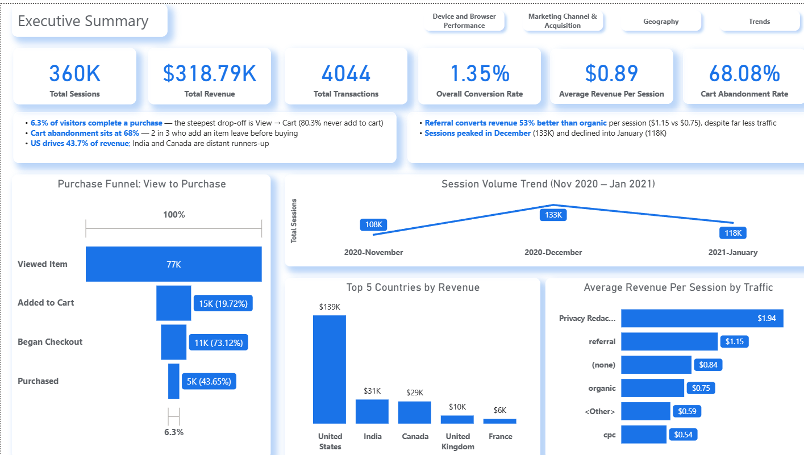
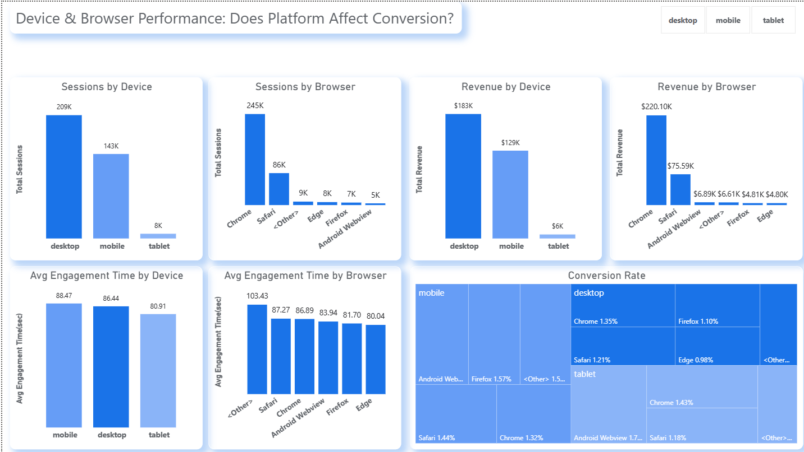
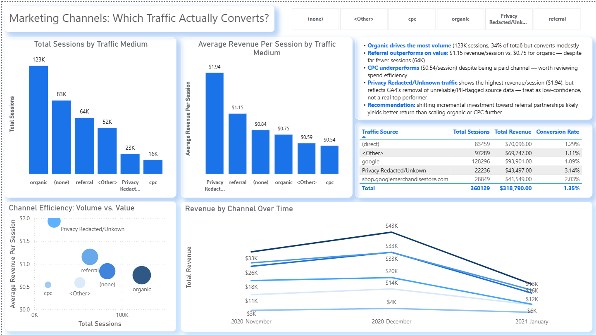
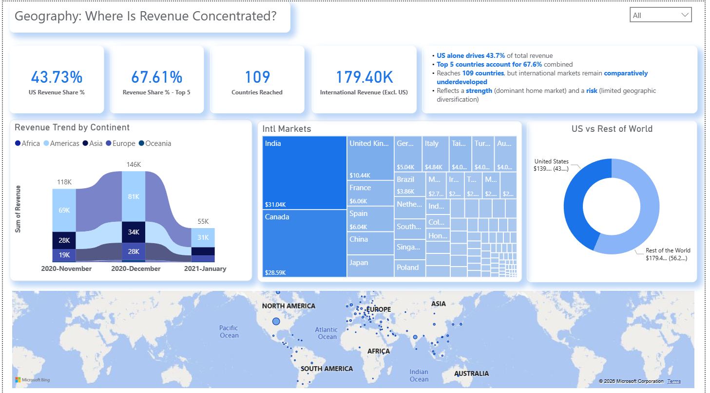
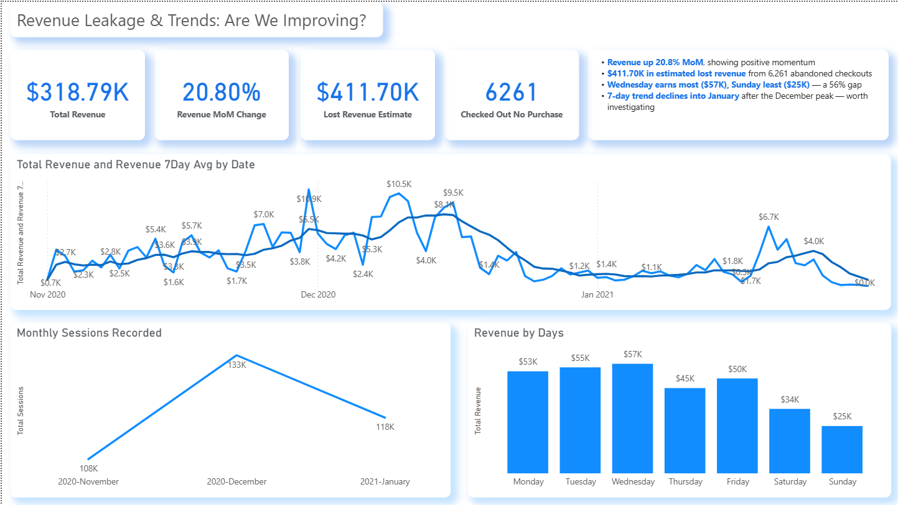

# GA4 Ecommerce Analytics: Funnel, Retention & Revenue Leakage

An end-to-end Power BI product analytics dashboard built on real Google Merchandise Store GA4 event data, analyzing where the business loses customers and revenue across the online purchase journey.



---

## Business Background

**Scenario:** This project analyzes real Google Merchandise Store GA4 data through the lens of a Product Analyst engagement. The core business question driving it is:

> *Where are we losing customers and revenue in the online journey, and what should we fix first?*

The dashboard breaks this into five analytical areas: funnel conversion, device/browser performance, marketing channel value, geographic concentration, and revenue trends over time.

**Dataset:** [GA4 BigQuery Flattened Dataset](https://huggingface.co/datasets/gizdevans/ga4-bq-flattened-data) — a pre-flattened export of Google's official public `bigquery-public-data.ga4_obfuscated_sample_ecommerce` dataset (Google Merchandise Store), covering Nov 2020 – Jan 2021 (92 days), ~4.3M events, 60 columns, MIT licensed.

---

## Data Architecture

### Pipeline Overview

```
Raw GA4 CSV (4.29M events, 60 cols)
        │
        ▼
Power Query: null cleanup, type correction, corrupted-row removal
        │
        ▼
DuckDB: SQL GROUP BY → session-level aggregation
        │
        ▼
sessions.csv (360,129 sessions, 22 cols)
        │
        ▼
Power BI: Star Schema (FactSessions + DateTable)
```

### Why DuckDB, not Power Query, for the session-level aggregation

Power Query's native Group By on 4.29M rows repeatedly stalled from memory pressure, even after environment cleanup (freeing RAM, pausing OneDrive sync). Rather than compromise on data scope, the session-level aggregation was moved to **DuckDB**, a lightweight SQL engine that processes CSVs directly off disk without loading the full dataset into memory.

This mirrors standard ELT/BI architecture practice: heavy transformation belongs in a data engine (SQL/warehouse layer), not the BI visualization tool. The full aggregation query is documented below.

### Star Schema

- **FactSessions** (360,129 rows) — one row per session, grain: `ga_session_id` + `user_pseudo_id`
- **DateTable** — standalone, continuous calendar table (Nov 1 2020 – Jan 31 2021), with Year/Quarter/Month/Day hierarchy
- Relationship: `FactSessions[SessionDateReal]` → `DimDate[Date]`, Many-to-One, single direction

### Session-Level Aggregation (DuckDB SQL)

```sql
COPY (
  SELECT
    ga_session_id,
    user_pseudo_id,
    MIN(event_timestamp) AS SessionStart,
    MAX(event_timestamp) AS SessionEndTimestamp,
    MIN(event_date) AS SessionDate,
    MAX(device_category) AS DeviceCategory,
    MAX(device_os) AS DeviceOS,
    MAX(browser) AS Browser,
    MAX(continent) AS Continent,
    MAX(country) AS Country,
    MAX(city) AS City,
    MAX(traffic_source) AS TrafficSource,
    MAX(traffic_medium) AS TrafficMedium,
    MAX(traffic_campaign) AS TrafficCampaign,
    COUNT(*) AS TotalEvents,
    SUM(engagement_time_msec) AS TotalEngagementMsec,
    MAX(ecom_revenue_usd) AS Revenue,
    MAX(ecom_transaction_id) AS TransactionId,
    MAX(CASE WHEN event_name = 'view_item' THEN 1 ELSE 0 END) AS ViewedItem,
    MAX(CASE WHEN event_name = 'add_to_cart' THEN 1 ELSE 0 END) AS AddedToCart,
    MAX(CASE WHEN event_name = 'begin_checkout' THEN 1 ELSE 0 END) AS BeganCheckout,
    MAX(CASE WHEN event_name = 'purchase' THEN 1 ELSE 0 END) AS Purchased
  FROM read_csv_auto('full_flatten_data.csv', ignore_errors=true)
  GROUP BY ga_session_id, user_pseudo_id
) TO 'sessions.csv' (HEADER, DELIMITER ',');
```

---

## Data Quality Findings

Real data quality issues were investigated and documented rather than silently patched:

| Finding | Detail | Resolution |
|---|---|---|
| Literal `"null"` text | Several numeric columns contained the string `"null"` instead of true blanks, breaking type conversion | Replaced globally in Power Query before type conversion |
| Duplicate header rows | 49 rows (0.001% of 4.3M) contained stray header text mid-file, from source export chunking across 92 daily tables | Removed via `Remove Errors` post-type-conversion |
| Purchases missing Transaction ID | 804 sessions (16.6% of purchase-flagged sessions) show a `purchase` event with no valid `TransactionId` | Used event-based `Purchased Sessions` as the primary conversion metric rather than ID-based `Total Transactions`; both are retained and documented |
| `(data deleted)` / Privacy Redacted values | Some `TrafficSource`/`TrafficMedium` values are redacted by Google post-collection (PII/reliability flagging), not report-level thresholding | Renamed to "Privacy Redacted/Unknown," retained but flagged as low-confidence in all revenue-per-session analysis |

---

## Key DAX Measures

**Foundation**
```dax
Total Sessions = COUNTROWS(FactSessions)
Total Revenue = SUM(FactSessions[Revenue])
Purchased Sessions = CALCULATE(COUNTROWS(FactSessions), FactSessions[Purchased] = 1)
Overall Conversion Rate = DIVIDE([Purchased Sessions], [Total Sessions], 0)
```

**Funnel (dynamic stage measure via SWITCH)**
```dax
Funnel Sessions = 
SWITCH(
    SELECTEDVALUE(FunnelStages[StageName]),
    "Viewed Item", [Viewed Item Sessions],
    "Added to Cart", [Added to Cart Sessions],
    "Began Checkout", [Began Checkout Sessions],
    "Purchased", [Purchased Sessions],
    BLANK()
)
```

**Time Intelligence**
```dax
Revenue MoM Change = 
VAR CurrentRevenue = [Total Revenue]
VAR PriorRevenue = CALCULATE([Total Revenue], DATEADD(DimDate[Date], -1, MONTH))
RETURN DIVIDE(CurrentRevenue - PriorRevenue, PriorRevenue, 0)

Revenue 7Day Avg = 
CALCULATE(
    AVERAGEX(VALUES(DimDate[Date]), [Total Revenue]),
    DATESINPERIOD(DimDate[Date], MAX(DimDate[Date]), -7, DAY)
)
```


*Full measure list available in the .pbix file.*

---

## Dashboard Pages

### 1. Executive Summary

Headline KPIs and cross-page teaser visuals for quick-glance review.

### 2. Device & Browser Performance — *Does Platform Affect Conversion?*
 
- Mobile converts marginally better than desktop (1.39% vs 1.32%) — contrary to typical ecommerce assumptions
- Edge converts 27% below average (0.98% vs 1.35%) despite meaningful traffic

### 3. Marketing Channels — *Which Traffic Actually Converts?*

- Organic drives the most volume (123K sessions) but converts modestly
- Referral converts revenue 53% better than organic per session ($1.15 vs $0.75) despite far less traffic
- CPC (paid) underperforms all organic channels at $0.54/session

### 4. Geography — *Where Is Revenue Concentrated?*

- US alone drives 43.7% of total revenue; top 5 countries account for 67.6% combined
- Reaches 109 countries, but international markets remain comparatively underdeveloped

### 5. Revenue Leakage & Trends — *Are We Improving?*

- Revenue up 20.8% month-over-month
- $411.70K in estimated lost revenue from 6,261 abandoned checkouts
- Wednesday earns the most revenue ($57K), Sunday the least ($25K)
- 7-day rolling trend declines into January after the December peak — worth further investigation

---

## Tools Used

Power BI Desktop · Power Query (M) · DAX · DuckDB (SQL) 

## Author

Ovidha Das — [](https://www.linkedin.com/in/ovidha-das-72a370116)
